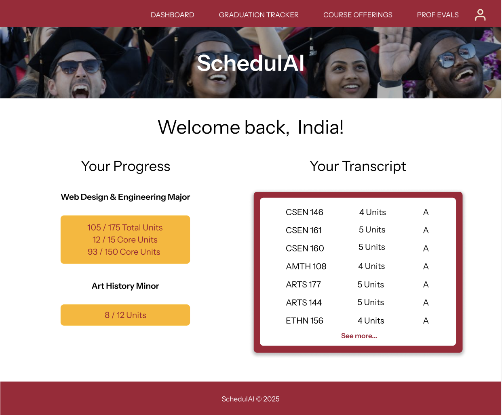

# SchedulAI

An academic planning & scheduling assistant for SCU students. Upload a transcript to see degree progress, get a graduation timeline, browse course offerings, and sync schedules with peers—all in one place.

---

## ✨ What it does

- **Transcript Analyzer**  
  Highlights degree progress, completed units, and outstanding requirements

- **Graduation Predictor**  
  Estimates graduation quarter based on remaining units + average units per quarter

- **Course Offerings Tracker**  
  Shows times, location, units, instructor, and availability

- **Professor & Course Evaluation**  
  Lets students rate difficulty level, clarity, workload balance, and leave comments

- **Schedule Sync (planned)**  
  Finds overlapping free time with peers for group work or mentoring

- **Chatbot (planned)**  
  Helps with quick questions about degree audit and navigation

*These features are derived from our project proposal and Figma prototype.*

---

## 🧭 Screens / Prototype

### 🎨 Figma Prototype (Interactive)

👉 https://www.figma.com/design/RMApU0HgIb9UaAfxeGDOLv/SchedulAI?node-id=0-1&t=2ztU6TrfwwlQ4uVP-1

> Full Figma source file is stored in:  
> `/docs/SchedulAI.fig`

---

### 📸 UI Preview

#### Dashboard

  

#### Course Offerings

  

#### Graduation Tracker

  

#### Professor & Course Evaluation

  

#### Profile Page

  

#### Login Page

  

---

## 🧠 Design → Build Workflow

1. **User Problem Identified**  
   Students currently use multiple systems (Workday, Degree Audit, eCampus), making academic planning fragmented.

2. **Wireframing + UX Research (Figma)**  
   Designed screens for dashboard, course tracker, graduation timeline, and evals.

3. **High-Fidelity UI**  
   Converted UI into React-readable components.

4. **Build (in progress)**  
   - Transcript parsing → graduation predictor → scheduling → evaluation workflows

---

## 🧱 Tech (planned)

| Layer       | Technology (current plan)              |
|------------|----------------------------------------|
| Frontend   | React + TypeScript (Vite)              |
| Backend    | Python (FastAPI) or Node.js (Express)  |
| Database   | SQLite / PostgreSQL                    |
| Charts     | Recharts                               |
| Auth       | JWT / OAuth (TBD)                      |

---

## 🔧 Local Development (coming soon)

Code will be added once backend + frontend setup is finalized.

